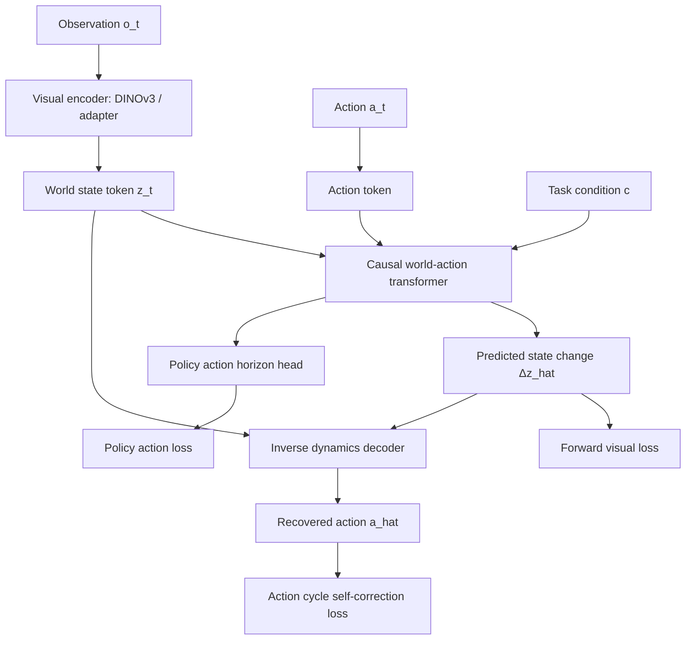

# Unified Corrective Foresight Model Design

Last updated: 2026-07-16

## 1. Executive Summary

Corrective Foresight 的目标不应只是把 video prediction 和 action prediction 放在同一个工程里训练，而是构建一个面向机器人控制的统一因果世界-动作模型：

```text
observed world state z_t
        + candidate / demonstrated action a_t
        ↓
causal world-action transformer
        ↓
future state change Δz_{t+1}
        ↓
inverse dynamics decoder
        ↓
recoverable / executable action â_t
```

核心论文观点可以写成：

> We learn a causal world-action model that predicts action-conditioned future state changes and regularizes those predictions through forward-inverse self-correction, so the predicted future is not only visually plausible but also action-executable.

对应中文表达：

> 我们提出一种基于因果 Transformer 的统一世界-动作模型，在联合建模 action-conditioned future state change 和 inverse action decoding 的过程中，引入 forward-inverse self-correction consistency，使预测的未来状态变化既符合视觉/状态演化，又能够被逆动力学解码为可执行动作。

这比“先训练视觉、再训练动作、再加一个自校正阶段”的工程叙述更适合作为论文主线。训练阶段仍然可以保留 warm-start 和 ablation，但论文方法应强调统一建模目标，而不是阶段名字。

## 2. Current Project State

当前代码已经具备 Corrective Foresight 的基础组件，但还没有完全落到 token-level unified world-action modeling。

### 2.1 Implemented Components

主要文件：

```text
unified_video_action/policy/corrective_foresight_policy.py
unified_video_action/model/autoregressive/causal_video_action.py
unified_video_action/model/autoregressive/self_correction.py
unified_video_action/model/vision/frozen_dino.py
unified_video_action/config/model/corrective_foresight_policy.yaml
train_corrective_foresight.sh
```

已经实现的能力：

- DINOv3/DINOv2/SmallCNN frame encoder，将图像序列编码为 visual tokens。
- Causal temporal transformer backbone，时间维度使用 causal mask，避免未来 token 泄漏。
- `video` stage：学习 `z_t -> z_{t+1}` 或 `z_t -> Δz_{t+1}` 的视觉未来预测。
- `action_horizon` stage：从当前观测窗口预测未来动作块。
- `joint` stage：同时计算视觉未来损失和动作损失。
- `self_correction` stage：启用 `SelfCorrectionModule`，增加视觉到动作、动作到视觉的一致性损失。
- 多数据集 metadata 接口 `condition`，为 PushT、LIBERO、robomimic/RoboCasa、RoboTwin 等数据集扩展预留入口。

### 2.2 Current Limitation

目前 `CausalVideoActionModel` 的核心输入是每个 timestep 一个融合后的向量：

```python
x = visual_proj(visual_tokens)
if action_tokens is not None:
    x = x + action_proj(action_tokens)
if proprio_tokens is not None:
    x = x + proprio_proj(proprio_tokens)
```

这意味着当前模型更像是：

```text
visual feature + optional action feature + optional proprio feature
        ↓
causal temporal transformer
        ↓
visual head / action head
```

它不是严格意义上的 UVA-style token stream，例如：

```text
[state token, action token, state token, action token, ...]
```

因此论文中应该谨慎表述当前实现为：

- causal temporal world-action backbone
- action-conditioned future state prediction
- inverse/forward self-correction regularization

如果要做成更强的论文贡献，后续实现应升级为真正的 unified token sequence。

## 3. Recommended Final Method

推荐把模型定义为 Unified Corrective Foresight，一套因果 forward-inverse world-action model。

### 3.1 Token Definitions

对每条 demonstration trajectory：

```text
o_t      raw observation, e.g. RGB image / proprio / language
z_t      encoded world state token from observation o_t
a_t      robot action token
Δz_t     state change token, z_{t+1} - z_t
c        optional task condition, e.g. language instruction / dataset id / task id
```

对于 PushT：

```text
c = dataset/task/action-space metadata
language_present = 0
```

对于 LIBERO：

```text
c = language instruction embedding + dataset/task/action-space metadata
language_present = 1
```

### 3.2 Causal Token Stream

目标模型应该用统一 token stream 表示 world state 和 action：

```text
[c, z_0, a_0, Δz_1, z_1, a_1, Δz_2, z_2, ...]
```

或者更紧凑地：

```text
[c, z_0, a_0, z_1, a_1, z_2, ...]
```

推荐第一种，因为显式 `Δz` 更符合本项目的“未来状态变化”叙事，也更容易接入 self-correction。

时间因果约束：

```text
token at time t can attend to tokens at <= t
token at time t cannot attend to future state/action tokens
```

同一帧内部仍允许 bidirectional spatial fusion，由 DINOv3 或后续视觉 adapter 完成。

### 3.3 Forward Dynamics Objective

Forward dynamics 学习：

```text
Fθ(z_t, a_t, c) -> Δẑ_{t+1}
```

训练目标：

```text
L_forward = MSE(Δẑ_{t+1}, Δz_{t+1})
```

若使用 delta token：

```text
Δz_{t+1} = z_{t+1} - stop_grad(z_t)
ẑ_{t+1} = z_t + Δẑ_{t+1}
```

这个目标对应“给定当前世界状态和动作，预测下一时刻世界如何变化”。

### 3.4 Inverse Dynamics Objective

Inverse dynamics 学习：

```text
Iφ(z_t, Δz_{t+1}, c) -> â_t
```

训练目标：

```text
L_inverse = MSE(â_t, a_t)
```

这个目标对应“给定当前状态和目标/预测状态变化，解码出最可能造成该变化的动作”。

### 3.5 Self-Correction Consistency

Self-correction 不是单独第三阶段才出现的补丁，而应该进入联合建模过程。

关键约束：

```text
a_t
  -> Fθ(z_t, a_t)
  -> Δẑ_{t+1}
  -> Iφ(z_t, Δẑ_{t+1})
  -> â_t
```

动作 cycle loss：

```text
L_action_cycle = MSE(â_t, a_t)
```

可选 forward cycle：

```text
Δz_{t+1}
  -> Iφ(z_t, Δz_{t+1})
  -> â_t
  -> Fθ(z_t, â_t)
  -> Δz̃_{t+1}

L_delta_cycle = MSE(Δz̃_{t+1}, Δz_{t+1})
```

总损失推荐：

```text
L = λ_fwd L_forward
  + λ_inv L_inverse
  + λ_cyc L_action_cycle
  + λ_delta L_delta_cycle
  + λ_pol L_policy
```

第一版可以设置：

```text
λ_fwd = 1.0
λ_inv = 1.0
λ_cyc = 0.1
λ_delta = 0.1
λ_pol = 1.0
```

如果训练不稳定，先关闭 `L_delta_cycle`，保留 `L_action_cycle`。

### 3.6 Policy Head

在控制时，模型需要从观测窗口输出动作：

```text
πψ(z_{t-k:t}, c) -> a_{t:t+H}
```

这里有两种实现路线：

1. Direct action head：从 causal temporal features 直接预测未来动作 horizon。
2. Planning-by-foresight：采样/候选动作，使用 forward dynamics 预测未来状态变化，再由 inverse/self-correction 约束筛选更可执行的动作。

当前工程更接近路线 1；论文增强版可以逐步引入路线 2 作为 future work 或 advanced variant。

## 4. Training Strategy

推荐将论文方法写成三个概念阶段，而不是把 2A/2B 当核心贡献。

### 4.1 Stage 1: World State Change Pretraining

目的：

```text
learn z_t and Δz_{t+1} prediction
```

输入：

```text
image/proprio sequence
```

损失：

```text
L_forward_visual = MSE(z_t + Δẑ_{t+1}, z_{t+1})
                 + α MSE(Δẑ_{t+1}, Δz_{t+1})
                 + β cosine_loss(ẑ_{t+1}, z_{t+1})
```

当前 `video` stage 已经基本实现这个目标。

### 4.2 Stage 2: Unified Joint Forward-Inverse Modeling

目的：

```text
jointly learn state change prediction, inverse action decoding, and policy action prediction
```

输入：

```text
z_t, a_t, z_{t+1}, optional condition c
```

损失：

```text
L_forward
L_inverse
L_action_cycle
L_policy
```

这才是论文中的主要训练阶段。

旧的 `2A action_horizon` 可以保留为 ablation：

```text
action-only baseline without world-change objective
```

旧的 `2B joint` 可以保留为 ablation：

```text
joint forward prediction without full self-correction consistency
```

但推荐论文主方法直接称为：

```text
Unified Corrective Foresight Training
```

### 4.3 Stage 3: Closed-Loop Evaluation and Optional Policy Refinement

目的：

```text
measure whether the learned world-action model improves closed-loop control
```

应包含：

- PushT rollout reward / success.
- LIBERO success rate.
- action error diagnostic.
- future-state prediction diagnostic.
- ablation over self-correction weights.
- inference latency.

Stage 3 不一定要是单独训练阶段。它更适合作为：

- evaluation protocol
- optional rollout fine-tuning
- optional self-correction stronger ablation

## 5. Relationship to Current Stages

当前脚本：

```text
./train_corrective_foresight.sh <task> <gpus> video
./train_corrective_foresight.sh <task> <gpus> action_horizon
./train_corrective_foresight.sh <task> <gpus> joint
./train_corrective_foresight.sh <task> <gpus> self_correction
```

推荐重新解释为：

| Script Stage | Current Role | Paper Role |
| --- | --- | --- |
| `video` | visual future / delta pretraining | Stage 1 world-change pretraining |
| `action_horizon` | action-only warmup | ablation or warmup, not main method |
| `joint` | action + visual joint loss | partial unified modeling baseline |
| `self_correction` | joint loss + correction module | early version of main self-corrective objective |

后续最重要的代码改造不是继续拆更多阶段，而是让 `joint` 或新的 `unified` stage 直接训练：

```text
forward dynamics + inverse dynamics + action cycle self-correction
```

## 6. Architecture Upgrade Plan

### 6.1 Minimal Upgrade

在现有 `CorrectiveForesightPolicy` 上做最小改动：

1. 保留 DINOv3 frame encoder。
2. 保留 `CausalVideoActionModel`。
3. 在 `full_dynamic_model` 中增加 inverse dynamics action decoder。
4. 对齐视觉 transition 和动作 timestep：

```text
context_visual = z[:, :-1]
target_visual = z[:, 1:]
target_action = a[:, :T-1]
target_delta = target_visual - context_visual
```

5. 计算：

```text
pred_delta = visual_head(features(z_t, a_t))
pred_visual = z_t + pred_delta
inverse_action_from_target = I(z_t, target_delta)
inverse_action_from_pred = I(z_t, pred_delta)
```

6. 损失：

```text
L_forward = visual prediction loss
L_inverse = MSE(inverse_action_from_target, a_t)
L_cycle = MSE(inverse_action_from_pred, a_t)
```

优点：

- 改动小。
- 复用当前模型和训练脚本。
- 适合快速验证 self-correction 是否真的提升 LIBERO/PushT。

缺点：

- 仍然不是严格 token-level unified model。
- action token 和 visual token 是加和融合，不是独立 token 交互。

### 6.2 Full Unified Token Upgrade

新建或重构为 `UnifiedWorldActionTransformer`：

```text
token_type_embed: state / action / delta / condition
time_embed: timestep
modality_embed: vision / proprio / language / action
```

输入 token stream：

```text
[condition, z_0, a_0, Δz_1, z_1, a_1, Δz_2, ...]
```

输出 heads：

```text
state_delta_head
inverse_action_head
policy_action_head
optional confidence/executability_head
```

优点：

- 和 UVA/UWM/LingBot-VA 的统一建模叙事更接近。
- 容易扩展到 language/task/dataset conditioning。
- 方法贡献更清晰。

缺点：

- 代码改动更大。
- 需要更系统的 causal mask 测试。
- 训练稳定性需要重新调参。

### 6.3 Recommended Route

建议先做 Minimal Upgrade，完成一个可复现实验闭环：

```text
PushT sanity check -> LIBERO-10 -> self-correction ablation
```

如果结果显示 self-correction 有稳定收益，再推进 Full Unified Token Upgrade。这样论文风险更低，也不会因为一次性重构过大拖慢实验。

## 7. Dataset Extension Strategy

### 7.1 PushT

用途：

- 快速 sanity check。
- 几何控制和接触趋势验证。
- 可视化 GIF 展示模型真实闭环行为。

局限：

- 数据集简单。
- 不包含语言条件。
- 不足以证明通用机器人能力。

论文中建议定位为 diagnostic benchmark，不作为唯一主结果。

### 7.2 LIBERO

用途：

- 多任务机器人操作。
- 可引入语言条件。
- 适合验证模型是否能从 task/language condition 中获益。

推荐：

- 先跑 LIBERO-10。
- 然后扩展 LIBERO-Spatial/Object/Goal/Long。
- 报告 success rate，而不是只看 loss。

### 7.3 RoboMimic / RoboCasa-Style HDF5

用途：

- 标准 imitation learning 数据接口。
- 方便做 action/state/image 的跨任务扩展。
- RoboCasa 可以提供更多 long-horizon household manipulation 任务。

推荐：

- 先接入 1-2 个 robomimic image task，验证 dataset abstraction。
- 再考虑 RoboCasa。

### 7.4 RoboTwin

用途：

- 双臂和更复杂操作。
- 适合展示多 embodiment / synthetic diversity。

推荐：

- 放在第二阶段扩展，不要一开始就作为主实验。
- 先确认 action representation、camera observation、success metric 是否能统一。

### 7.5 DROID / Open X-Embodiment

用途：

- 大规模真实机器人数据。
- 可作为未来预训练方向。

当前不建议立刻全量接入，因为数据规模和工程复杂度很高。更合理的路线是先把模型接口做成可接收 dataset/task/action-space/language metadata。

## 8. Language Conditioning

这个模型不一定必须依赖语言条件。

推荐策略：

```text
PushT: no language
LIBERO: use language
RoboMimic/RoboCasa: optional language/task id
RoboTwin: optional language/task id
```

模型接口应该支持语言，但论文主张不应绑定为“语言模型”。更稳妥的说法是：

```text
task-conditioned causal world-action modeling
```

语言只是 task condition 的一种形式。

对于 LIBERO，语言条件可以作为：

```text
condition token c_lang
```

进入 token stream：

```text
[c_dataset, c_task, c_lang, z_0, a_0, Δz_1, ...]
```

如果没有语言，就使用 learned null-language token。

## 9. Metrics and Diagnostics

### 9.1 Training Metrics

必须保留：

```text
train_loss
val_loss
visual_loss
visual_mse_loss
visual_delta_loss
visual_cosine_loss
action_loss
action_horizon_loss
inverse_action_loss
self_correction_cycle_loss
copy_last_mse
improvement_vs_copy_last
pred_token_std
target_token_std
pred_delta_std
target_delta_std
```

指标解释：

- `visual_mse_loss`: 预测下一状态 token 和目标 token 的距离。
- `visual_delta_loss`: 预测状态变化和真实状态变化的距离。
- `visual_cosine_loss`: 方向相似度，防止只靠尺度拟合。
- `copy_last_mse`: 直接复制当前帧/状态作为下一状态的 baseline。
- `improvement_vs_copy_last`: 是否真的比复制当前状态更好。
- `pred_token_std`: 预测 token 的分布宽度，过低可能表示 collapse。
- `pred_delta_std`: 预测变化幅度，过低表示模型可能不敢预测变化。
- `inverse_action_loss`: 逆动力学能否从状态变化恢复动作。
- `self_correction_cycle_loss`: 预测变化是否能被逆动力学解码回原动作。

### 9.2 Healthy Training Signs

健康曲线应该表现为：

```text
visual_loss decreases, then plateaus
action_loss decreases, then plateaus
inverse_action_loss decreases, then plateaus
improvement_vs_copy_last > 0
pred_delta_std does not collapse to 0
pred_token_std stays in the same order as target_token_std
validation loss does not keep increasing while train loss decreases
```

如果出现：

```text
val_visual_loss steadily increases
val_visual_cosine_loss steadily increases
pred_delta_std collapses to near zero
improvement_vs_copy_last <= 0
```

说明模型可能在过拟合、复制当前状态、或视觉预测被动作损失压坏。

### 9.3 Evaluation Metrics

论文级结果应报告：

- PushT reward / success / GIF qualitative examples。
- LIBERO success rate。
- Action L2 作为 diagnostic，不作为唯一指标。
- Future state prediction improvement over copy-last。
- Inference latency。
- Self-correction ablation。

## 10. Related Papers and Borrowable Ideas

### 10.1 Unified Video-Action / World-Action Modeling

1. [Unified Video Action Model](https://arxiv.org/html/2503.00200v2)

   可借鉴点：

   - 将视频和动作放进统一生成/预测框架。
   - 强调 video-action joint modeling。
   - 适合作为本项目“为什么要统一建模视觉和动作”的主要 related work。

   与本项目区别：

   - 本项目主张因果时序预测和机器人闭环控制。
   - 本项目加入 forward-inverse self-correction，使 future state change 必须 action-executable。

2. [Unified World Models](https://arxiv.org/html/2504.02792v1)

   可借鉴点：

   - 统一世界模型不仅预测视频，也服务于动作和决策。
   - 可以借鉴其 world model framing。

   与本项目区别：

   - 本项目更聚焦机器人 manipulation。
   - 本项目把 inverse dynamics 和 self-correction 作为核心约束。

3. [World Action Models are Zero-shot Policies](https://arxiv.org/html/2602.15922v1)

   可借鉴点：

   - 将 world/action model 直接转化为 policy。
   - 强调 action-conditioned world prediction 可以服务于 zero-shot control。

   与本项目区别：

   - 本项目从 demonstration imitation 和 closed-loop benchmark 出发。
   - 本项目不是只依赖 zero-shot，而是通过 self-correction 提高动作可执行性。

4. LingBot-VA / Causal World Model Direction

   可借鉴点：

   - 使用因果 world-action 建模进行未来预测。
   - 强调从当前状态和动作预测未来世界状态。

   与本项目关系：

   - 本项目应对齐这种“因果未来预测”的方向。
   - 但本项目的独特点应放在 forward-inverse corrective consistency，而不是简单复现因果 Transformer。

### 10.2 Inverse Dynamics and Executable Future Prediction

5. [SC3-Eval](https://arxiv.org/html/2606.18610v1)

   可借鉴点：

   - 用 consistency/correction 的思想评估或约束 embodied agent。
   - 强调模型输出是否能通过后续动态一致性检验。

   与本项目区别：

   - 本项目把 self-correction 作为训练目标，而不只是评估协议。

6. [Executable Video Alignment](https://arxiv.org/html/2603.17808v1)

   可借鉴点：

   - 关注视频生成/预测是否能转化为可执行动作。
   - 和本项目“预测未来状态变化后通过逆动力学解码动作”高度相关。

   与本项目区别：

   - 本项目不只做 video alignment，而是直接训练机器人控制 policy。

7. [Predictive Inverse Dynamics Models are Scalable Learners for Robotic Manipulation](https://arxiv.org/abs/2412.15109)

   可借鉴点：

   - 将预测未来状态和逆动力学动作恢复结合起来。
   - 可以作为 inverse dynamics decoder 的理论支撑。

   与本项目区别：

   - 本项目使用因果 unified transformer，并将 inverse dynamics 纳入自校正 cycle。

8. [Diffusion Policy](https://arxiv.org/abs/2303.04137)

   可借鉴点：

   - 机器人 visuomotor policy 的强基线。
   - Action chunking、closed-loop replanning、denoising action generation 都可以作为 baseline 或实验设计参考。

   与本项目区别：

   - 本项目不是纯 action diffusion policy，而是 world-action causal foresight model。

### 10.3 Visual Representation

9. [DINOv2](https://arxiv.org/abs/2304.07193) / DINOv3-Style Frozen Visual Features

   可借鉴点：

   - 使用强视觉基础模型作为 frozen perceptual/token encoder。
   - 对小数据集更稳定，减少视觉 encoder 从零训练的成本。

   与本项目关系：

   - 当前代码已经使用 DINOv3 优先、DINOv2 fallback。
   - 后续若要生成 RGB 重建视频，需要增加 latent-to-image decoder 或 VAE decoder，不应指望 DINO token 直接可视化为真实视频。

### 10.4 Datasets and Benchmarks

10. [LIBERO](https://arxiv.org/abs/2306.03310)

    可借鉴点：

    - 多任务、语言条件、lifelong robot learning。
    - 适合作为本项目从 PushT 走向 A 会级实验的第一批核心 benchmark。

11. [Open X-Embodiment](https://arxiv.org/abs/2310.08864)

    可借鉴点：

    - 大规模跨机器人数据。
    - 支持未来预训练和跨 embodiment 实验设计。

12. [DROID](https://arxiv.org/abs/2403.12945)

    可借鉴点：

    - 大规模真实机器人操作数据。
    - 可作为后续真实数据扩展方向。

13. [RoboTwin](https://arxiv.org/abs/2504.13059)

    可借鉴点：

    - 双臂、复杂操作、synthetic diversity。
    - 适合作为后续增强 benchmark，但不建议作为第一阶段主战场。

## 11. Paper Positioning

推荐论文题目方向：

```text
Corrective Foresight: Self-Correcting Causal World-Action Models for Robot Control
```

核心贡献可以写成三点：

1. Causal world-action foresight model:

   ```text
   a causal Transformer that jointly models robot actions and future world-state changes
   ```

2. Forward-inverse self-correction:

   ```text
   a consistency objective that requires predicted future state changes to be decodable into executable actions
   ```

3. Multi-benchmark validation:

   ```text
   evaluation on PushT and LIBERO, with ablations on visual foresight, inverse dynamics, and self-correction
   ```

不建议主张：

```text
We build a LingBot-VA-scale general model.
```

更稳妥的主张：

```text
We study a compact but reproducible causal world-action modeling framework for robot manipulation.
```

## 12. Next Engineering Priorities

优先级 1：把 self-correction 放进 joint training 主目标。

```text
Add inverse_action_loss and action_cycle_loss to full_dynamic_model.
```

优先级 2：统一 stage 命名。

推荐新增：

```text
stage=unified
```

或者让当前：

```text
stage=self_correction
```

成为主方法，而不是 Stage 3 补丁。

优先级 3：LIBERO 作为主验证。

```text
Stage 1 ckpt -> unified joint self-corrective training -> LIBERO rollout success
```

优先级 4：PushT qualitative GIF。

保留 PushT GIF 作为直观展示，但不要用它承担全部论文证据。

优先级 5：未来 RGB 重建模块。

当前 DINOv3 token 不能直接重建真实视频。后续可以增加：

```text
visual token -> VAE latent/RGB decoder
```

用于展示 predicted future video vs target video。

## 13. Recommended Short-Term Commands

如果先继续当前工程路线，推荐：

```bash
cd /mnt/workspace/wwl/corrective-foresight
source .venv/bin/activate
export VISUAL_ENCODER=dinov3
export LOGGING_MODE=online
export LIBERO_DATASET_PATH=data/libero10
```

从 Stage 1 warm-start：

```bash
STAGE1_CKPT="data/outputs/train_corrective_foresight_libero10/video/2026-07-16/13-07-47/checkpoints/epoch=0000-val_loss=0.0027.ckpt"
```

当前可运行的 joint/self-correction baseline：

```bash
./train_corrective_foresight.sh libero10 4 self_correction \
  training.resume=False \
  training.init_from_checkpoint="$STAGE1_CKPT" \
  training.num_epochs=10 \
  training.checkpoint_every=1 \
  training.sample_every=1 \
  dataloader.batch_size=16 \
  val_dataloader.batch_size=16
```

但从论文目标看，下一步更推荐先修改代码，使 `self_correction` 或 `unified` stage 真正包含：

```text
L_forward + L_inverse + L_action_cycle
```

然后再重新训练。

## 14. Risks and Mitigations

### Risk 1: The model only learns copy-last visual prediction.

Mitigation:

- 保留 `copy_last_mse` 和 `improvement_vs_copy_last`。
- 要求 validation improvement 持续为正。
- 监控 `pred_delta_std` 不要塌缩。

### Risk 2: Action loss dominates and destroys visual foresight.

Mitigation:

- 使用 `joint_visual_weight`。
- 对 forward/inverse/cycle loss 分别记录。
- 采用 warm-start，而不是从零开始 joint 训练。

### Risk 3: Self-correction only improves loss, not rollout.

Mitigation:

- 必须做 closed-loop rollout。
- 在 PushT 和 LIBERO 都比较 no-correction vs correction。
- 报告 success rate，不只看训练曲线。

### Risk 4: Dataset interfaces diverge.

Mitigation:

- 保留 `condition` metadata。
- 每个 dataset 统一输出 `obs`, `action`, `condition`。
- language 可选，不强制 PushT 使用语言。

### Risk 5: RGB future visualization cannot be generated.

Mitigation:

- 短期用 token diagnostics 和 rollout GIF。
- 中期增加 VAE/decoder，将 predicted token decode 成 RGB future。

## 15. One-Page Method Diagram



The key idea is the loop:

```text
action -> predicted future state change -> recovered action
```

The predicted future is useful for control only if this loop is consistent.
